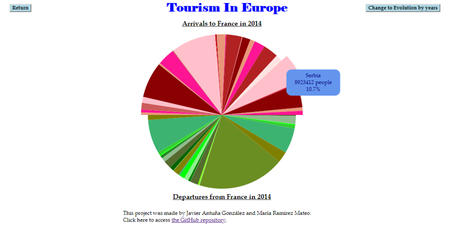
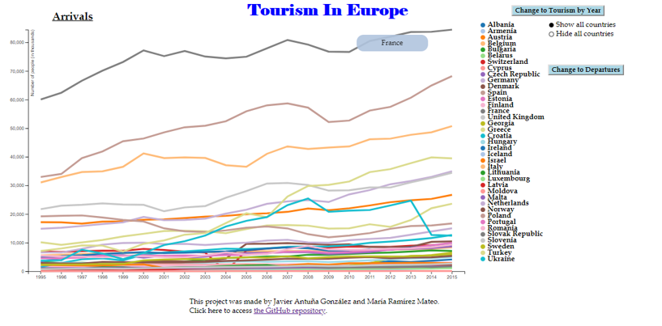

# EuroTurismVis

The main objective of this project is not only to show which countries are leading the numbers of incoming and outgoing tourists in the different years offered (1995-2015), but also visualize the movements of the tourist between the different European countries.

To do that we will use different graphics and several interactions between the web page and the user.

In this way we will show either the entries or the exits of each country each year or its evolution in a period. In addition, we will study for each country and year what are the numbers of entries and exits of travelers. It will allow us to compare whether the country receives or sends more people and the origin or destination of these people.

The first data shown are the entries and the exits of each country each year, that is to say, the number of people who arrived in France and the number of people who left the France in the year chosen, which can be changed by the user thanks to the slider included in the left corner. So, when the user changes the year selected, the visualisation shown in the web page will change automatically.

We have chosen the Bubble Chart to help the user to compare the difference in the number of people between the different countries. Moreover, with the colour scale we also help the user to understand either which country send more tourists aboad, or which country receives more visitors.

<table border="0">
  <tr>
    <td>
      
    </td>
  </tr>
</table>

In this first graphic we have also included a Tooltip to show the country name and the number of people represented by each circle, as is shown in the next picture.

<table border="0">
  <tr>
    <td>
      
    </td>
  </tr>
</table>

After that, once the user clicks in the chosen circle, we change the visualization to a second graphic, a Pie Chart, to compare the arrivals to and the departures from a country in the year 2014. Our initial idea was to offer this graphic for the years between 1995 and 2014. However, because of some problems that we have identified once we started working, we have had to correct all the data by hand. That is the reason why we decided to offer the graphic only for the year 2014, so, if we ever have the correct data we should only change the Excel worksheet and our visualization will offer all the years as expected.

<table border="0">
  <tr>
    <td>
      
    </td>
  </tr>
</table>

With this Pie Chart we try to help the user in the analyse of the information given. In this graphic he can easily know from which country come more tourists to the country chosen and where do his inhabitant go to on holidays with the help of a Tooltip. This Tooltip shows the country name, the number of people and the percentage that each country represents. That is the reason why we have chosen the Pie Chart, because it is a good Chart to represent proportions and it is easier to compare them.

Another important point is the fact that we have also worked with the same colour scale as the one in the first graphic. This can also help the user to understand all the information given in a short period of time.

<table border="0">
  <tr>
    <td>
      
    </td>
  </tr>
</table>

<table border="0">
  <tr>
    <td>
      
    </td>
  </tr>
</table>

<table border="0">
  <tr>
    <td>
      
    </td>
  </tr>
</table>

<table border="0">
  <tr>
    <td>
      
    </td>
  </tr>
</table>
