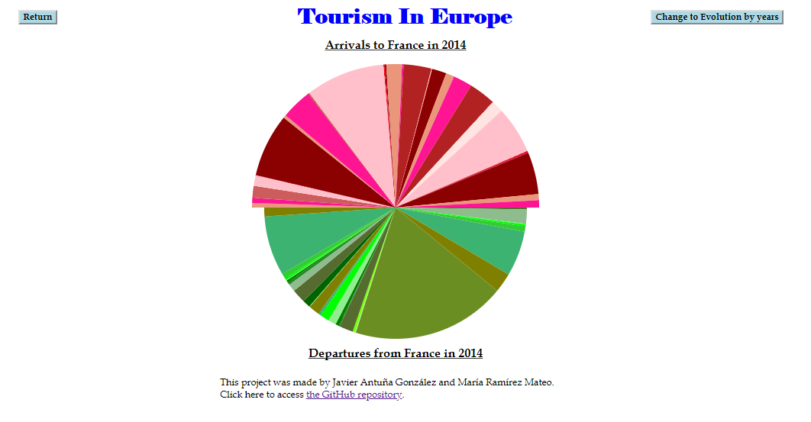

# EuroTurismVis

The main objective of this project is not only to show which countries are leading the numbers of incoming and outgoing tourists in the different years offered (1995-2015), but also visualize the movements of the tourist between the different European countries.

To do that we will use different graphics and several interactions between the web page and the user.

In this way we will show either the entries or the exits of each country each year or its evolution in a period. In addition, we will study for each country and year what are the numbers of entries and exits of travelers. It will allow us to compare whether the country receives or sends more people and the origin or destination of these people.

The first data shown are the entries and the exits of each country each year, that is to say, the number of people who arrived in France and the number of people who left the France in the year chosen, which can be changed by the user thanks to the slider included in the left corner. So, when the user changes the year selected, the visualisation shown in the web page will change automatically.

We have chosen the Bubble Chart to help the user to compare the difference in the number of people between the different countries. Moreover, with the colour scale we also help the user to understand either which country send more tourists aboad, or which country receives more visitors.

<table border="0">
  <tr>
    <td>
      
    </td>
  </tr>
</table>

In this first graphic we have also included a Tooltip to show the country name and the number of people represented by each circle, as is shown in the next picture.

<table border="0">
  <tr>
    <td>
      
    </td>
  </tr>
</table>

After that, once the user clicks in the chosen circle, we change the visualization to a second graphic, a Pie Chart, to compare the arrivals to and the departures from a country in the year 2014. Our initial idea was to offer this graphic for the years between 1995 and 2014. However, because of some problems that we have identified once we started working, we have had to correct all the data by hand. That is the reason why we decided to offer the graphic only for the year 2014, so, if we ever have the correct data we should only change the Excel worksheet and our visualization will offer all the years as expected.

<table border="0">
  <tr>
    <td>
      
    </td>
  </tr>
</table>

With this Pie Chart we try to help the user in the analyse of the information given. In this graphic he can easily know from which country come more tourists to the country chosen and where do his inhabitant go to on holidays with the help of a Tooltip. This Tooltip shows the country name, the number of people and the percentage that each country represents. That is the reason why we have chosen the Pie Chart, because it is a good Chart to represent proportions and it is easier to compare them.

Another important point is the fact that we have also worked with the same colour scale as the one in the first graphic. This can also help the user to understand all the information given in a short period of time.

<table border="0">
  <tr>
    <td>
      
    </td>
  </tr>
</table>

## Tourism Evolution

To the top right of the screen display, is a button which contains the message "Change to Evolution by Years". By clicking on this button the user accesses a new graphic which is completely different from the previous graphics.

<table border="0">
  <tr>
    <td>
      
    </td>
  </tr>
</table>

The graphic that appears on the screen is known as Multi-line Chart. As the Bubble Charts only show the results for a specific year, we considered it necessary to include a different graphic visualizing the tourism trends in the different countries in recent years.

<table border="0">
  <tr>
    <td>
      
    </td>
  </tr>
</table>

The title "Arrivals" means that the curves of the countries that are going to be shown on the screen correspond to the data of the number of tourists who go to a specific country according to the year.

Occupying a large part of the visualization, we can observe that there is a space reserved for the Multi-line Chart, which is delimited by two axes. The x-axis represents a time scale which includes the last twenty years from 1995 to 2015. On the other hand, the y-axis symbolizes the number of people expressed **in thousands**. The scale of the y-axis marks a value of 0 while no curve is displayed within the graph.

The Chart legend is located to the right of the space which contains the Multi-line Chart. This legend is constituted by the ordered list of European countries which make up our tourism visualization and which have already appeared in the previous Bubble Charts and Pie Charts. Each country has an associated colored circle which identifies it and which is placed on the left side of the country name in gray.

To begin the curves visualization of the different countries, just interact with the colored circles next to each country. When we move the mouse over one of those circles, the circle increases in size so that the user easily knows the country on which the cursor will act.

<table border="0">
  <tr>
    <td>
      
    </td>
  </tr>
</table>

By clicking on the circle that has increased in size, the curve of the corresponding country is shown in the Multi-line Chart. This curve is represented in the same color as the selected circle.

We can also see how the scale of the y-axis has changed since it is a dynamic axis. This means that every time the Multi-line Chart is updated by entering or deleting one country curve, the scale of the axis will change according to the curves that are displayed after the graph is updated. By selecting another different country, by clicking on the circle assigned to it, the scale of the y-axis may change depending on the new data.

For example, if the values of the new selected country go beyond the scale set by the curve of the first country, the following figure shows how the scale adapts to the new maximum value of the curves and changes its values through a transition. It can also be seen that the curve of the first selected country has contracted due to the change in scale.

<table border="0">
  <tr>
    <td>
      
    </td>
  </tr>
</table>

If, on the contrary, the new selected country corresponds to values lower than the maximum of the country already shown, then the y-axis will maintain its scale of values.

<table border="0">
  <tr>
    <td>
      
    </td>
  </tr>
</table>

Every time a new country is selected, in addition to displaying its curve on the screen, the text with the name of the country is highlighted changing from gray to black and represented in bold. This makes it easier for the user to know the countries whose curves are being displayed on the screen.

There is no limit to the number of curves shown in the Multi-line Chart, therefore, we can select all the countries we want to show all of them. The colors of the curves are always consistent with the circles associated with each country.

When the number of country curves which appear in the Multi-line Chart is large, it can be difficult to identify the curves with their corresponding country because the colors of several countries are similar. In order to know the country to which each curve corresponds, we have included a Tooltip. When the mouse passes over a curve, it shows a blue background text box where the country to which that curve corresponds is indicated.

<table border="0">
  <tr>
    <td>
      
    </td>
  </tr>
</table>

Once the mouse passes over a curve, the text box is fixed and displayed even though the user moves the cursor out of the curve, so that the user can know the country without having to place the cursor exactly on the curve all the time. The Tooltip appears at the point of the curve through which the cursor passes and it changes when the user passes through the curve of another country or through another part of the same curve.

In the same way that countries can be selected to be shown in the Multi-line Chart, a curve of a country can also be removed from the chart. To do this, just click on the circle of a country which is in bold (which means that its curve is being displayed). Once this is done, the curve will disappear from the Multi-line Chart and the text of the country name will no longer be in bold and will turn gray again.

When we select a country to stop showing it in the graph, it may also happen that the scale of the y-axis changes. If the maximum value of the removed curve is the maximum of all the curves shown, then the scale will be updated to the new values.

Next to the list of countries, on its right side, we can see two other circles whose content colors are black and white and which are beside the texts "Show all countries" and "Hide all countries", respectively. If we click on the "Show all countries" circle, the curves of all the countries in the list will be shown in the Multi-line Chart (see image below). On the other hand, if we click on the "Hide all countries" circle, all the countries in the graph will stop being shown, which lets the user to empty and reinitialize the graph without having to remove the countries one by one.

<table border="0">
  <tr>
    <td>
      
    </td>
  </tr>
</table>

Below the "Show all countries" and "Hide all countries" buttons, we can fin the button that contains the text "Change to Departures".

<table border="0">
  <tr>
    <td>
      
    </td>
  </tr>
</table>

By clicking on this button we can access the departures graph, that is, the Multi-line Chart which displays the evolution of the number of people from a specific country who carry out tourism in other countries. In fact, we can see how the title of the graph changes to "Departures".

<table border="0">
  <tr>
    <td>
      
    </td>
  </tr>
</table>

The functioning of this visualization is the same as the arrivals chart. The only thing that changes is the curves of the Multi-line Chart since they now display the departures data, as it can be seen in the following image.

<table border="0">
  <tr>
    <td>
      
    </td>
  </tr>
</table>

If the user wishes to access the arrival chart again, he can do so by clicking on the "Change to Arrivals" button on the right side of the screen.

<table border="0">
  <tr>
    <td>
      
    </td>
  </tr>
</table>

Finally, if the user wants to return to the Bubble Charts, he can do so by clicking on the "Change to Tourism by Year" button, which is located at the top right of the display.

<table border="0">
  <tr>
    <td>
      
    </td>
  </tr>
</table>

The different buttons and interactions allow us to change between the different charts as many times as we want and thus we visualize in the most useful way the data on tourism in Europe.
